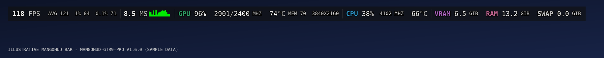

# mangohud-gtr9-pro

[](CHANGELOG.md)
[](https://github.com/flightlessmango/MangoHud)
[](#license)

Expanded MangoHud config for the Beelink GTR9 Pro (Ryzen AI Max+ 395 / Radeon 8060S, RDNA 3.5 / Strix Halo) on CachyOS Wayland with RADV. A horizontal top-of-screen bar built with MangoHud's `horizontal` layout directive (equivalent to its Horizontal preset, `preset=2`) and a diagnostics-oriented metric set: FPS with 1% / 0.1% lows, frametime (+ graph), GPU load with clocks and edge/memory temperatures, render resolution, CPU load with frequency and temperature, and the full UMA memory triad (`vram` + `ram` + `swap`). Every directive is readout-only — nothing here changes frame pacing, vsync, or rendering. The metric labels render uppercase; only MangoHud's fixed unit suffixes (`ms`, `MHz`, `GiB`) carry mixed case, which no config option can change.

## Table of contents

- [Compatibility](#compatibility)
- [Install](#install)
- [Usage](#usage)
- [Example output](#example-output)
- [Metrics](#metrics)
- [Files](#files)
- [License](#license)

## Compatibility

| Component | Required |
|---|---|
| MangoHud | `≥ 0.8.3` |
| Kernel   | `≥ 6.14` |
| Vulkan   | RADV (Mesa 24.x+) |

## Install

```fish
mkdir -p ~/.config/MangoHud
cp ./MangoHud.conf ~/.config/MangoHud/MangoHud.conf
```

## Usage

Steam launch options:

```
mangohud %command%
gamemoderun mangohud %command%
```

Toggle in-game: `Shift_R + F12`.

The bar is anchored top-left by default; set `position=top-center` (or `top-right`) in `MangoHud.conf` to move it along the top edge.

## Example output

A single horizontal row across the top of the screen (values are sample data; clocks in MHz, temperatures in Celsius):

```
118 FPS  AVG 121  1% 84  0.1% 71  │  8.5 MS ▁▂▃▁▂▁  │  GPU 96%  2901 MHZ  2400 MHZ  74°C  MEM 70  3840X2160  │  CPU 38%  4102 MHZ  66°C  │  VRAM 6.5 GIB  RAM 13.2 GIB  SWAP 0.0 GIB
```



## Metrics

| Directive | Shows |
|---|---|
| `fps` + `fps_metrics=avg,1,0.1` | current FPS plus average, 1% low, and 0.1% low |
| `frametime` | frametime in milliseconds |
| `frame_timing` | inline frametime line graph (stutter spikes) |
| `gpu_stats` + `gpu_core_clock` + `gpu_mem_clock` | GPU load and core / memory clocks |
| `gpu_temp` + `gpu_mem_temp` | GPU edge and memory temperatures |
| `resolution` | current render resolution |
| `cpu_stats` + `cpu_mhz` + `cpu_temp` | CPU load, frequency, and temperature |
| `vram` + `ram` + `swap` | unified memory pool usage and swap |

Notes:
- `gpu_junction_temp` is omitted: on this APU (gfx1151) the junction/hotspot sensor mirrors the edge value that `gpu_temp` already reports, so it would only duplicate the GPU temperature.
- `gpu_mem_clock` and `gpu_mem_temp` require `vram` (enabled).
- The GTR9 Pro shares a single LPDDR5X pool between CPU and GPU, so `vram` and `ram` draw from the same unified memory.
- Driver, GPU-name, and engine readouts (`vulkan_driver`, `gpu_name`, `engine_version`) are intentionally omitted: they are the only free-form strings MangoHud renders in lowercase, and there is no option to force them uppercase.

## Files

```
mangohud-gtr9-pro/
├── CHANGELOG.md
├── MangoHud.conf
├── README.md
└── example.png
```

## License

MIT
